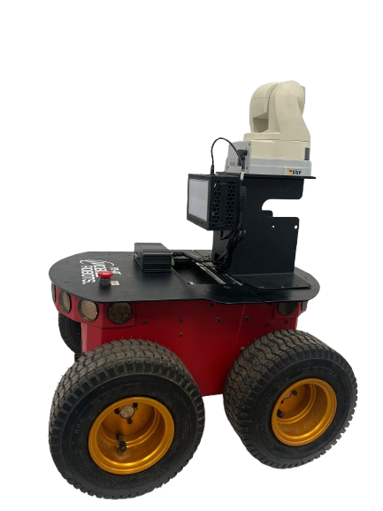

# Projeto ROS para Controle de Robô com Câmera e Agente de Aprendizado por Reforço

Este projeto ROS (Robot Operating System) consiste em três pacotes principais: `axis_camera`, `pionner_control` e `rl_agent`. Cada pacote tem uma funcionalidade específica para controlar um robô, capturar imagens de uma câmera e aplicar um agente de aprendizado por reforço.
<p align="left">
  
</p>

## Estrutura do Projeto

## Pacotes

### axis_camera

# 1. Conectar a Câmera e Configurar o IP

1. **Acesse pela conexão Wi-Fi:**
   - Conecte seu notebook à rede Wi-Fi da câmera (Master Pionner3 2).

2. **Conecte a câmera Wi-Fi:**
   - Agora você deve conseguir visualizar o feed da câmera pelo aplicativo no seu notebook, acessando o endereço: `http://192.168.0.20`.

3. **Faça login de acesso à câmera:**
   - Quando solicitado, insira as credenciais fornecidas:
     - **Usuário (Username):** `root`
     - **Senha (Password):** `p3at`

Este pacote é responsável por capturar imagens de uma câmera IP e publicá-las no tópico `/camera/image_raw`.

- **Arquivo de Nó:** [camera_node.py](axis_camera/src/camera_node.py)
- **Lançamento:** [camera.launch](axis_camera/launch/camera.launch)


### pionner_control

Este pacote controla o movimento do robô publicando comandos de velocidade no tópico `/cmd_vel`.

- **Arquivo de Nó:** [control_node.py](pionner_control/src/control_node.py)
- **Lançamento:** [control.launch](pionner_control/launch/control.launch)


### rl_agent

Este pacote implementa um agente de aprendizado por reforço que processa imagens da câmera e decide ações para controlar o robô.

- **Arquivo de Nó:** [agent_node.py](rl_agent/src/agent_node.py)
- **Lançamento:** [rl_agent.launch](rl_agent/launch/rl_agent.launch)

## Como Executar

1. **Configurar o Ambiente ROS:**
   Certifique-se de que o ROS está instalado e configurado corretamente no seu sistema.

2. **Compilar o Workspace:**
   Navegue até o diretório do workspace e compile os pacotes:
   ```sh
   cd /home/jonas/catkin_ws
   catkin_make

3. **Fonte o Setup do Workspace:**
   ```sh
   source devel/setup.bash

4. **Executar os Nós**
   - Inicie o nó da câmera:
   ```sh
   roslaunch axis_camera camera.launch
  - Inicie o nó de controle
    ```sh
    roslaunch pionner_control control.launch
 - Inicie o nó do agente de aprendizado por reforço:
    ```sh
    roslaunch rl_agent rl_agent.launch

## Dependências
- ROS (Kinetic ou superior)
- OpenCV
- NumPy
- Requests
- PyTorch
- cv_bridge
- sensor_msgs
- geometry_msgs

## Guia: Passo a Passo para Configurar o Repetidor

### 1. Prepare seu notebook para configurar o repetidor

1. **Configurações de rede de acesso:**
   - Conecte seu notebook ao repetidor usando um cabo Ethernet.
   - Configure manualmente as seguintes informações de rede no seu notebook:
     - **Endereço IP:** `192.168.0.10` (ou qualquer IP entre `192.168.0.2` e `192.168.0.254`, exceto `192.168.0.1` que é o IP do repetidor)
     - **Máscara de sub-rede:** `255.255.255.0`
     - **Gateway:** `192.168.0.1` (IP do repetidor)
     - **DNS preferencial:** `0.0.0.0`
   - Clique em "OK" para salvar as alterações.

### 2. Configurar o Repetidor

1. **Conecte o repetidor:**
   - Mantenha seu notebook conectado ao repetidor usando o cabo Ethernet.

2. **Acesse a página de configuração do repetidor:**
   - Abra um navegador de internet no seu notebook.
   - Digite o endereço IP do repetidor na barra de endereços: `192.168.0.1` e pressione Enter.

3. **Faça login no repetidor:**
   - Quando solicitado, insira as credenciais fornecidas:
     - **Usuário (Username):** `admin`
     - **Senha (Password):** `admin`
   - Clique em "Login" ou "OK".

4. **Siga o assistente de configuração do repetidor:**
   - Após o login, siga as instruções exibidas na interface de configuração do repetidor para finalizar o processo.


## Licença
Este projeto está licenciado sob a licença [TODO].

## Manutenção
Este projeto é mantido pelo Pesquisador Jonas Moreira - Projeto Super IOT-WP3. Para dúvidas ou sugestões, entre em contato pelo email jonas.barbosa@ufam.edu.br

